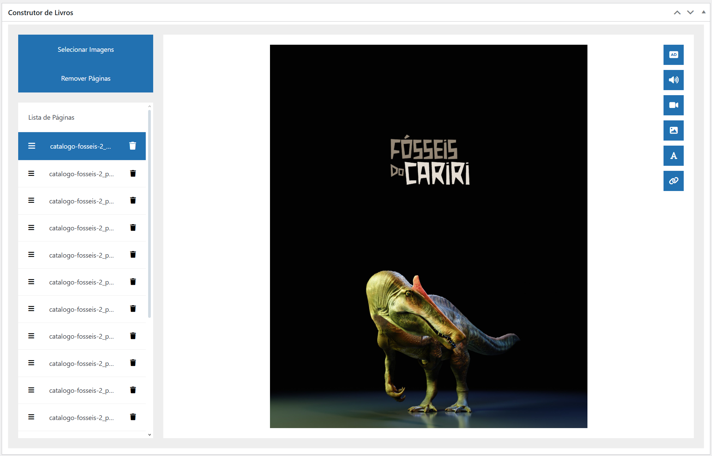
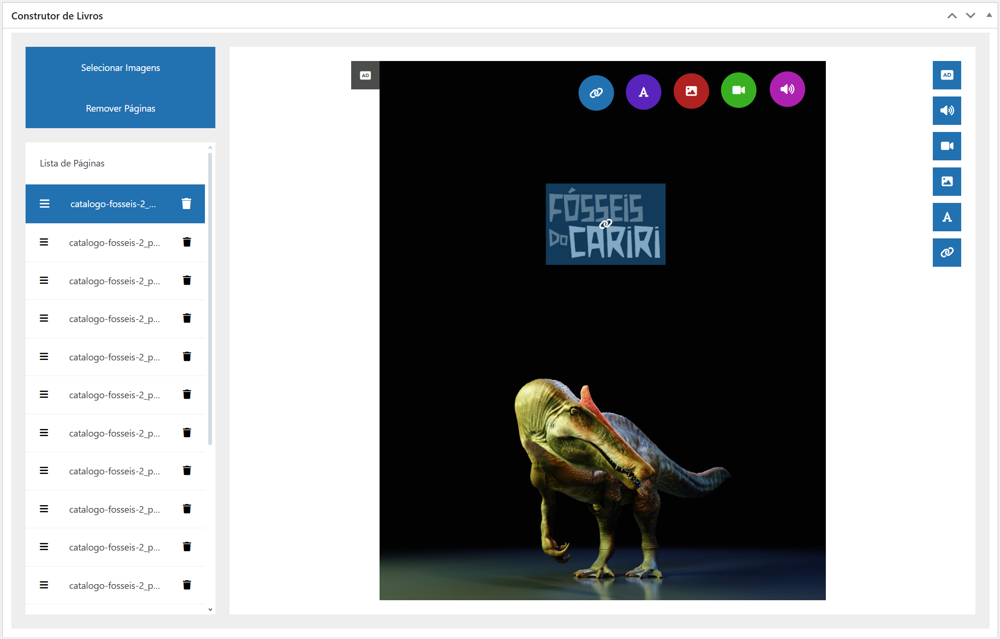
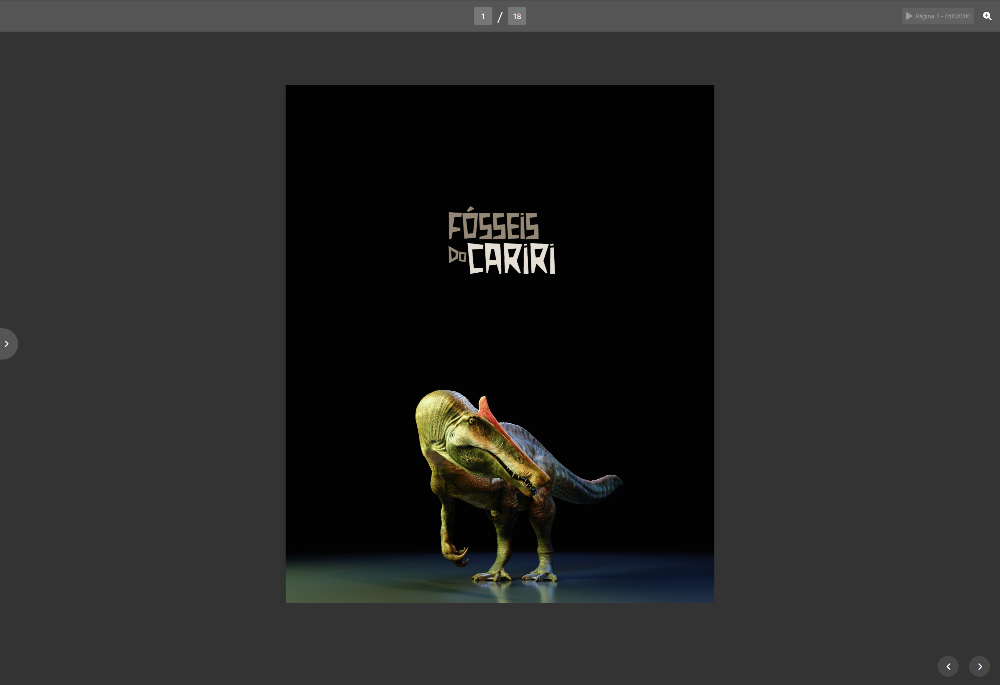
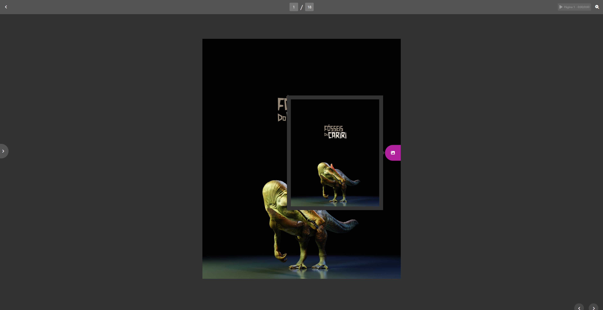
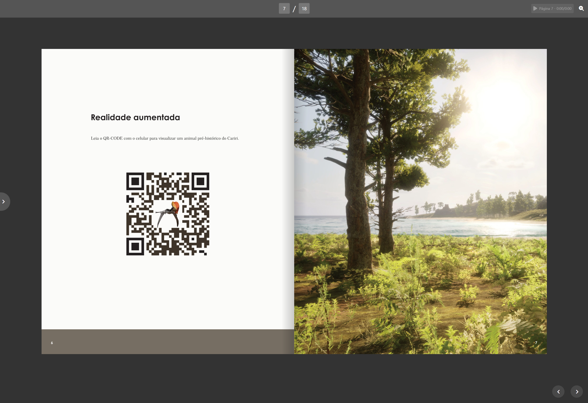

# Page Flipper - Documentation

## Description
The **Page Flipper** is a **free** WordPress plugin that enables the creation of interactive digital books. It adds a new post type for digital books, offering a set of features to manage books and add interactivity with hotspots.

## Features

- **Custom Post Type:**
  - A new post type called digital books.
  - Exclusive categories for digital books.
- **Book Builder:**
  - Upload images to create pages.
  - Reorder pages.
  - Add and remove pages.
  - Add **interactive hotspots**, such as:
    - Narration
    - Audio
    - Video
    - Image
    - Text
    - Link
- **PDF Upload:**
  - Optional, to allow book download in PDF format.
- **Shortcode for Embedding:**
  - Embed the digital book anywhere on the site.
  - Default format: `[page_flipper id="post_id"]`
  - Optional parameters:
    
    | Parameter      | Description                                  | Possible Values | Default   |
    |---------------|----------------------------------------------|-----------------|-----------|
    | `summary`     | Show or hide the summary                     | `yes` or `no`  | `yes`     |
    | `action_bar`  | Show or hide the action bar                  | `yes` or `no`  | `yes`     |
    | `controls`    | Show or hide controls                        | `yes` or `no`  | `yes`     |
    | `page_bg`     | Page background color                        | Hexadecimal    | `#333333` |
    | `action_bar_bg` | Action bar background color                | Hexadecimal    | `#555555` |
    | `summary_bg`  | Summary background color                     | Hexadecimal    | `#555555` |
    | `controls_icon` | Control icons color                        | Hexadecimal    | `#ffffff` |
    | `font_color`  | Book font color                             | Hexadecimal    | `#ffffff` |

- **Elementor Integration:**
  - Widget to add digital books.
  - Support for selecting a specific book or using the current query.

## Screenshots
Here are some screenshots showcasing the **Page Flipper** plugin in action:

  
  
  
  
  
  

## Language Support
The plugin is available in the following languages:

- English
- Brazilian Portuguese
- French
- Russian
- Spanish
- Japanese
- Traditional Chinese
- Simplified Chinese

## Contribution
If you want to contribute to the development of **Page Flipper**, feel free to send a pull request.

---

**Made with ❤️ by Willder Azevedo**