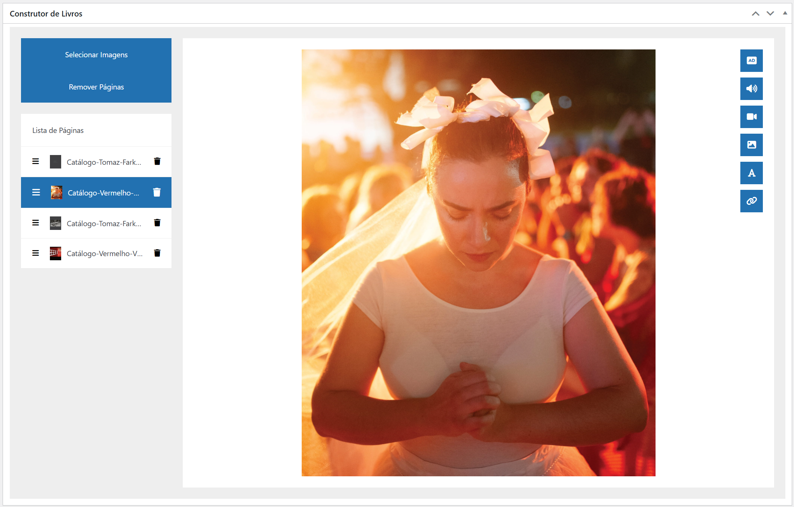
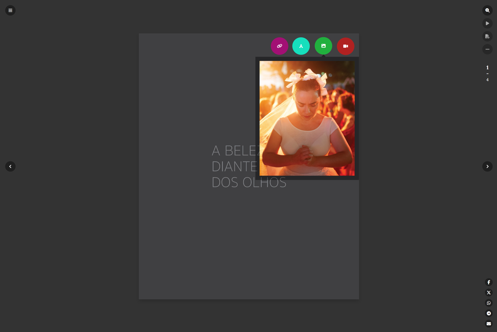

# Page Flipper

## Description
The **Page Flipper** is a **free** WordPress plugin that enables the creation of interactive digital books. It adds a new post type for digital books, offering a set of features to manage books and add interactivity with hotspots.

## Features

- **Custom Post Type:**
  - A new post type called digital books.
  - Exclusive categories for digital books.
- **Book Builder:**
  - Upload images to create pages.
  - Reorder pages.
  - Add and remove pages.
  - Add **interactive hotspots**, such as:
    - Narration
    - Audio
    - Video
    - Image
    - Text
    - Link
- **PDF Upload:**
  - Optional, to allow book download in PDF format.
- **Shortcode for Embedding:**
  - Embed the digital book anywhere on the site.
  - Default format: `[page_flipper]`
  - Optional parameters:
    
    | Parameter                   | Description                              | Possible Values | Default              |
    | --------------------------- | ---------------------------------------- | --------------- | -------------------- |
    | `id`                        | The ID of the post                       | Post ID         | Current Query        |
    | `enable_summary`            | Show or hide the summary                 | `yes` or `no`   | `yes`                |
    | `enable_related`            | Show or hide the related posts           | `yes` or `no`   | `yes`                |
    | `enable_controls`           | Show or hide the controls                | `yes` or `no`   | `yes`                |
    | `enable_share`              | Show or hide the share buttons           | `yes` or `no`   | `yes`                |
    | `enable_zoom`               | Show or hide the zoom button             | `yes` or `no`   | `yes`                |
    | `enable_background_image`   | Use or not the cover image as background | `yes` or `no`   | `yes`                |
    | `page_background_color`     | Page background color                    | Hexadecimal     | `#333333`            |
    | `page_surface_color`        | Page surface color                       | RGBA or Hex     | `rgba(0, 0, 0, 0.4)` |
    | `page_surface_accent_color` | Page surface accent color                | Hexadecimal     | `#ffffff`            |
    | `page_accent_color`         | Page accent color                        | Hexadecimal     | `#eac101`            |
    | `page_font_color`           | Page font color                          | Hexadecimal     | `#ffffff`            |

- **Elementor Integration:**
  - Widget to add digital books.
  - Support for selecting a specific book or using the current query.

## Screenshots
Here are some screenshots showcasing the **Page Flipper** plugin in action:

  
  
  
  
  
  

## Language Support
The plugin is available in the following languages:

- English
- Brazilian Portuguese
- French
- Russian
- Spanish
- Japanese
- Traditional Chinese
- Simplified Chinese
- German

## 💖 Support This Project  
If you like this project, consider making a donation to help with development.  

